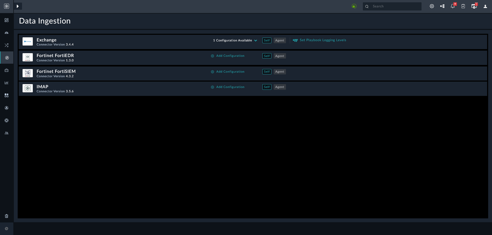

| [Home](../README.md) |
|----------------------|

# Configuring Alert Ingestion Process

Alert Ingestion is a process that periodically pulls actionable data from sources such as SIEM, EDR, and even email inboxes. For example, to respond to use cases involving suspicious emails, you would configure ingestion of emails from email providers like Exchange or GMail. 

The **Data Ingestion** page displays all the connectors that are installed and can be configured for alert ingestion using the **Data Ingestion Wizard**.

To view the **Data Ingestion** page, log on to FortiSOAR. On the left navigation pane, click **Automation** > **Data Ingestion**. This page displays connectors that are enabled for data ingestion, along with the count of configurations available for that connector.

1. To configure a connector for data ingestion, refer to the document [Configuring a connector in FortiSOAR](https://docs.fortinet.com/document/fortisoar/0.0.0/configuring-a-connector/1/configuring-a-connector#Configuring_a_connector_in_FortiSOAR_). Following connectors are installed, by default, with SOAR Framework Solution Pack:

    - **Exchange** - To configure the Exchange connector for data ingestion, refer to the document [Configure Data Ingestion in Exchange](https://docs.fortinet.com/document/fortisoar/3.4.4/exchange/148/exchange-v3-4-4#Configure_Data_Ingestion).

    - **Fortinet FortiEDR** - To configure the Fortinet FortiEDR connector for data ingestion, refer to the document [Configure Data Ingestion in Fortinet FortiEDR](https://docs.fortinet.com/document/fortisoar/1.3.0/fortinet-fortiedr/161/fortinet-fortiedr-v1-3-0#Configure_Data_Ingestion).

    There are multiple other connectors each with instructions to configure data ingestion. To search for and know more, refer to [FortiSOAR Connectors](https://docs.  fortinet.com/fortisoar/connectors).

2. The **Data Ingestion Wizard** maps the incoming data (from source) to target field in the [Alert Schema](./extending-default-alert-schema.md). During the mapping process, you might need to add some fields that are not present; to add new fields, refer to [Extending Default Alert Schema](./extending-default-alert-schema.md).

>[!Important]
>This is a key step to ensure correct mapping into alert schema, which subsequently becomes a part of the indicator extraction process.

3. Use the **Scheduling** screen, in the **Data Ingestion Wizard**, to configure schedule-based ingestion.

> [!Note]
> Some connectors, like the **Exchange** connector, support **Email Notification Service**. This service sets up a listener that instantly notifies FortiSOAR when a new email arrives in the targeted mailbox.

After the configuration is complete, the system is ready to ingest data and as per the defined mapping, create alerts in FortiSOAR.

| [Installation](./setup.md#installation) | [Configuration](./setup.md#configuration) | [Usage](./usage.md) | [Contents](./contents.md) |
|-----------------------------------------|-------------------------------------------|---------------------|---------------------------|
