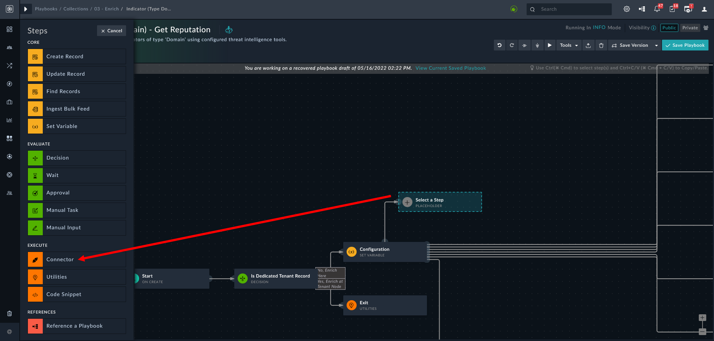
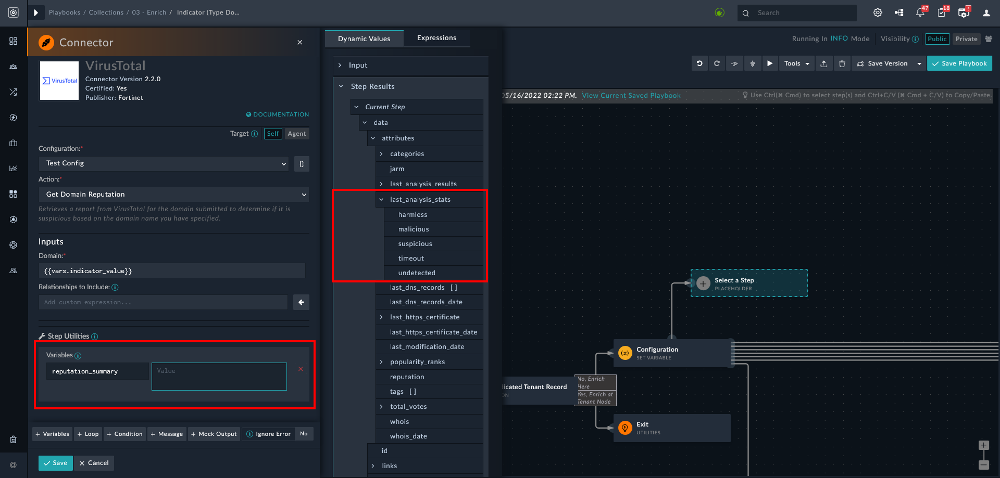
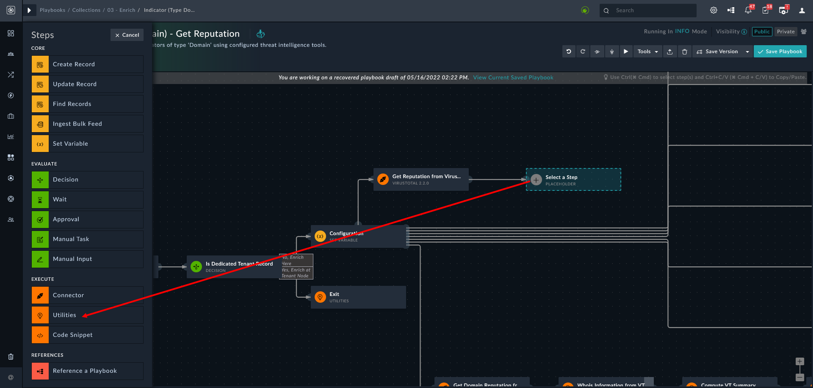

# Extending Default Indicator Enrichment Process

For every indicator &ndash; file URL, hash, domain, IP address, user &ndash; there is a corresponding enrichment playbook that goes through multiple intelligence platforms and other processes, collects the data, and puts that information in a formatted manner to the indicator record.

In the default Indicator Enrichment process,

* The playbooks run after indicator creation
* The playbooks take the *Type* and *Value* from the indicators
* It reaches out to various sources to set the reputation in the indicator record

Taking the data from these sources it formats and populates the description field with enrichment data.

While these playooks provide a strong foundation for enriching indicators in FortiSOAR, multiple configurations and subsequent playbook actions become available even after deployment. Going beyond investigation, you can add additional playbooks to run the indicators through various sources and services to get reputation and another context about indicators.

> Do not modify the playbooks directly as an upgrade or install may overwrite your changes; however, you can clone the playbooks and then make changes to avoid an overwrite.

## Example: Add Step to Get Reputation

> Take an example of AbuseIBDB -> example IP: 183.82.121.81

Consider a playbook **Indicator (Type Domain) - GetReputation** under the playbook collection **03 – Enrich (22)**. This playbook triggers when an indicator of type **Domain** is created. The playbook takes the data and runs it through sources like Anomali ThreatStream and AlienVault to get the reputation. The next step, in this playbook, formats the data received and fills the description. Following image shows the playbook

To add a step parallel to **Get Reputation...** refer to [playbooks steps in the playbooks guide](https://docs.fortinet.com/document/fortisoar/7.0.2/playbooks-guide/784146/triggers-steps#Playbook_Steps_..5). Following is the **Indicator (Type Domain) - GetReputation** playbook.


Subsequent steps help add a playbook step that fetches information from **VirusTotal**<sup>TM</sup>.

1. Configure the VirusTotal connector. For detailed instructions, refer to [VirusTotal connector document](https://docs.fortinet.com/document/fortisoar/2.2.0/virustotal/191/virustotal-v2-2-0).
2. Navigate to the playbook **Indicator (Type Domain) - GetReputation** under the playbook collection **03 – Enrich (22)**.
3. Add a new step after **Configuration**. For detailed instructions, refer to [playbooks steps in the playbooks guide](https://docs.fortinet.com/document/fortisoar/7.0.2/playbooks-guide/784146/triggers-steps#Playbook_Steps_..5).
4. Select **Connector** from the left sidebar, search for VirusTotal, and click the VirusTotal tile.
    
    

5. Enter a name for this configuration step. For this example, we selected `Get Reputation from VirusTotal` as the **Step Name**.
6. On the left pane, from the **Configuration** field drop-down, select the **Configuration** name specified in step 1.
7. Select **Get Domain Reputation** from the **Action** drop-down.
8. Click **Domain** field to specify *Dynamic Values*.
9. Under *Variables*, select `indicator_value`. With this step you ensure that any value in an indicator's `domain` field is extracted and run through the VirusTotal database.
10. Under **Step Utilities**, define a variable of your choosing. This variable stores the data (JSON object) that VirusTotal returns.
11. Specify the JSON data to store in this variable. Navigate to *Dynamic Values* > *Step Results* > *Current Step* > *attributes* > *last_analysis_stats* and select it.
    
    

12. Click **Save**.

## Example: Format Reputation Data

The data received from VirusTotal &ndash; and other connectors &ndash; is in JSON format. For human consumption, you might want to format it in a more readable manner. Subsequent steps help add a playbook step that formats the data for enhanced readability.

1. Add another step after **Get Reputation From VirusTotal** step and select **Utilities**.
    
    

2. Enter a name for this step.
3. Under **Action**, select **Utils: Format as RichText (Markdown)**.
4. Under **Value** in the **Inputs** section, write the HTML to format the JSON data as per your preference. For this example, we have formatted the VirusTotal output as following:

```html
  <div class="font-size-11 ng-binding padding-bottom-sm"><h4 style="background: #404142;padding: 5px;text-align: left;color: orange;background: black;"> VirusTotal Detection Summary</h4></div>
  <table style="border-color: #04080c;" border="1" class="font-normal">
  <tr><td style="border-color: #04080c;">
  <table style="color:white;font-size:11;" class="no-border">
  <tr>
  <td>
  <html>
    <head>
      <title>Title of the document</title>
      <style>
        span.circle {
          background: #2f3f51;
          border-radius: 50%;
          -moz-border-radius: 50%;
          -webkit-border-radius: 50%;
          display: inline-block;
           font-weight: bold;
          line-height: 100px;
          margin-right: 5px;
          text-align: center;
          width: 100px;
        font-size:15px;
       border-color: Black;
        }
      </style>
    </head>
    <body><span class="circle"><i style="font-size:25px;color:red ">
     {{vars.last_analysis_stats.malicious}}</i>/{{vars.last_analysis_stats.values() | list | sum}}</span>
    </body>
  </html>
  </td>

  <td>
  <div class="font-size-14 ng-binding">Malicious</div>
  <div class="card-container-body" style="width: 100px;font-size:46px;">
  <div class="card-number"; style="font-size:45px;  border-left: 5px solid red;background:#141b23">{{vars.last_analysis_stats.malicious}}</div>
  </div>
  </td>
  <td>
  <div class="font-size-14 ng-binding">Suspicious</div>
  <div class="card-container-body" style="width: 100px;">
  <div class="card-number" style="font-size:45px;  border-left: 5px solid orange; background:#141b23">{{vars.last_analysis_stats.suspicious}}</div>
  </div>
  </td>
  <td>
  <div class="font-size-14 ng-binding">Harmless</div>
  <div class="card-container-body" style="width: 100px;">
  <div class="card-number" style="font-size:45px;  border-left: 5px solid green; background:#141b23">{{vars.last_analysis_stats.harmless}}</div></div>
  </td>
  </tr>
  </table>

  <td style="vertical-align:top; border-color: #04080c;">
  <table style="background-color: #1b2430; color:white;font-size:16;" class="margin-10 no-border">
  <tr>
  <div class="margin-top-md">
  <i class="fa fa-group margin-left-md margin-right-sm"></i> Community Votes</div>

  <td style="width: 100px;text-align: center;background:#141b23">
  <i class="	fa fa-thumbs-o-up" style="font-size:25px;color:green"></i>
  <div class="font-size-11 ng-binding">Harmless {{vars.community_votes.harmless}}</div>
  </td>
  <td style="width: 100px;text-align: center;background:#141b23">
  <i class="fa fa-thumbs-o-down" style="font-size:25px;color:red "></i>
  <div class="font-size-11 ng-binding">Malicious {{vars.community_votes.malicious}}</div>
  </td>
  </tr>
  </table>
  </div>
  </td>
  </tr>
  </table>
```

5. Click **Save** to save your changes.

Once the above steps are done, connect the playbook step to *Is Malicious* decision step.

Now your enrichment playbook gets domain from VirusTotal as well.