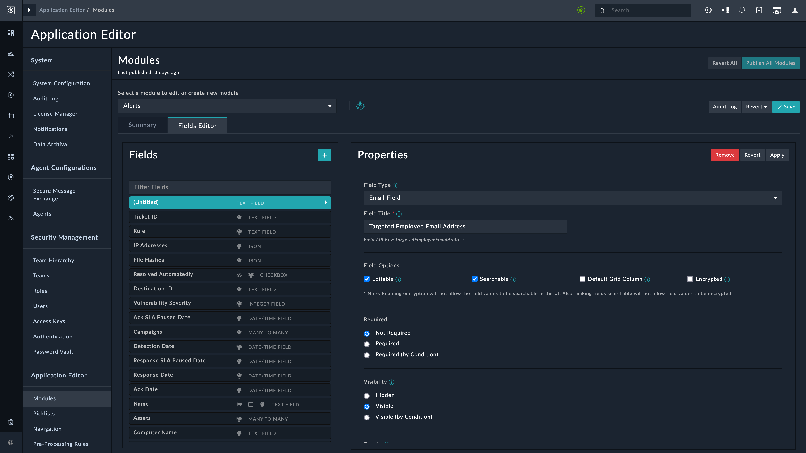
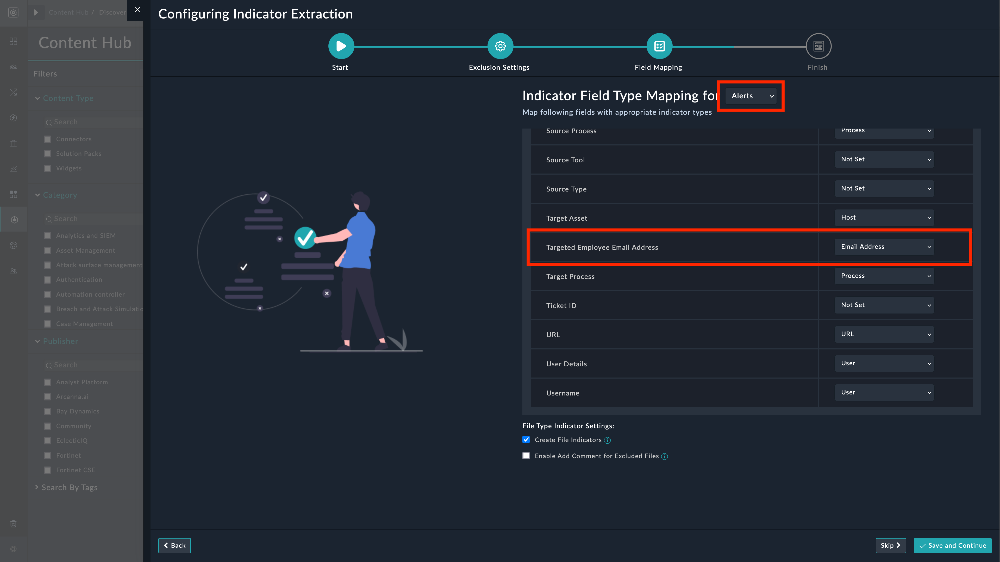
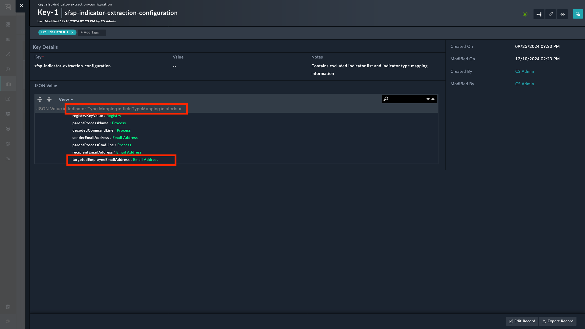
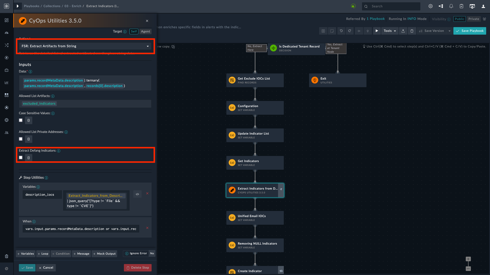

| [Home](../README.md) |
|----------------------|

# Extending Default Indicator Extraction Process

FortiSOAR has automated the indicator extraction process through sets of playbooks; however, you can enhance the indicator extraction process by adding more fields of interest to a playbook so that it picks more fields apart from the default ones specified in the playbook.

We recommend that you optimize the indicator extraction process and define extraction settings for each alert/incident type as needed.

For example, consider a custom field of interest *`Targeted Employee Email Address`*. This field of interest must be a part of the alert or incident that we intend to target.

1. **Adding a custom field**: Edit the alert or incident schema to include a field of interest **Targeted Employee Email Address** field (example). Refer to the following sections:

    - [Extending Default **Alert** Schema](./extending-default-alert-schema.md)
    - [Extending Default **Incident** Schema](./extending-default-incident-schema.md)

    

2. **Mapping the custom field**: Run the [Indicator Extraction Configuration](https://github.com/fortinet-fortisoar/widget-indicator-extraction-configuration/blob/release/1.0.0/docs/usage.md#edit-configuration-settings) wizard to map the alert's or incident's custom field with the indicator type.

    

3. **Saving Changes**: Click Save & Continue to save and apply the changes.

    The keystore record automatically updates with the new information once the wizard completes. The following image shows the keystore record `sfsp-indicator-extraction-configuration` containing the custom field mapped to email address for the **Alert** module.

    

Now your playbooks automatically capture indicators corresponding to the **Targeted Employee Email Address** field.

## Excluding Extracted Indicators from Enrichment

The [Indicator Extraction Configuration](https://github.com/fortinet-fortisoar/widget-indicator-extraction-configuration/blob/release/1.0.0/docs/usage.md#edit-configuration-settings) wizard guides you through adding indicators to be excluded for extraction.

> [!Note]
> The **Indicator Extraction Configuration** widget, apart from multiple other tasks, also manages the following settings:
> 1. Excluding Extracted Indicators from Enrichment
> 2. Adding Comment to Excluded File Alerts
> 3. Skip Creating File Indicators

### Extracting Defanged Indicators

You can extract defanged indicators (For example: The IP address `192.168.1.1` is popularly defanged as `192[.]168[.]1[.]1`) by enabling an option in the Utilities connector `v3.5.0` onwards.

The playbooks **03 - Enrich** > **Extract Indicators (Alerts)** and **Extract Indicators (Incidents)** refer to the utilities connector for indicator extraction. The Utilities connector `v3.5.0` onwards has deprecated the old action *FSR: Extract Artifacts from String*.

The new action with the same name &ndash; *FSR: Extract Artifacts from String* &ndash; can now extract defanged indicators if the option **Extract Defang Indicators** is enabled.



To extract defanged indicators:

- Edit the playbook **03 - Enrich** > **Extract Indicators (Alerts)** under the collection *03 - Enrich*. Enable the option **Extract Defang Indicators** in the following playbook steps:
    - `Extract Indicators from Header`
    - `Extract Indicators from Body`
    - `Extract Indicators from Description`

- Edit the playbook **03 - Enrich** > **Extract Indicators (Incidents)** under the collection *03 - Enrich*. Enable the option **Extract Defang Indicators** in the following playbook step:
    - `Extract Indicators from Description`

## Recommended/Advanced settings

The Exchange connector playbooks remove all special characters in the filename, **_except_** `-`, `\`, and `.`, when creating attachment records from email attachments. This results in file indicator still being created for files that contain other characters in their names, even if they are in the exclude list.

> For example, a file named `Demo-File_Attachment.txt` in the exclude list has no effect and a file indicator with the filename `Demo-FileAttachment.txt` is still created as the underscore (`_`) is suppressed by the playbooks.

Here are 2 possible ways to work around this situation:

1. **Change File Names**: Avoid using characters other than `-`, `\`, and `.` when adding filenames in the exclude list. For example, add the filename `Demo-FileAttachment.txt` instead of `Demo-File_Attachment.txt`, as the underscore (`_`) is suppressed by the Exchange ingestion playbooks.

2. **Modify the Regex**: Edit the `Upload File IOC and Create Attachment` step of the **> Exchange > Create Indicators and Attachments** playbook in the **Sample - Exchange - [version]** collection and modify the regex so that it does not suppress `_` or similar harmless characters in filenames.

    Remove the following:

    ```jinja
    "{{vars.input.params.attachmentMetadata.metadata.filename.split("/")[-1] | regex_replace("[^A-Za-z0-9. /\-]", "") if "/tmp/" in vars.input.params.attachmentMetadata.metadata.filename else vars.input.params.attachmentMetadata.metadata.filename |regex_replace("[^A-Za-z0-9. /\-]", "")}}"
    ```

    Replace with the following:

    ```jinja
    "{{vars.input.params.attachmentMetadata.metadata.filename.split("/")[-1] | regex_replace("[^A-Za-z0-9. /\-_]", "") if "/tmp/" in vars.input.params.attachmentMetadata.metadata.filename else vars.input.params.attachmentMetadata.metadata.filename |regex_replace("[^A-Za-z0-9. /\-_]", "")}}"
    ```

# Next Steps

| [Installation](./setup.md#installation) | [Configuration](./setup.md#configuration) | [Usage](./usage.md) | [Contents](./contents.md) |
|-----------------------------------------|-------------------------------------------|---------------------|---------------------------|
