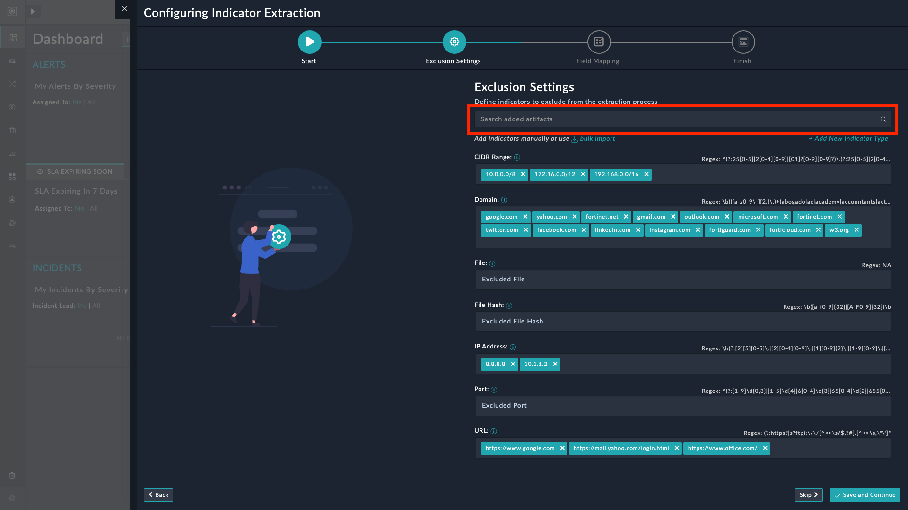
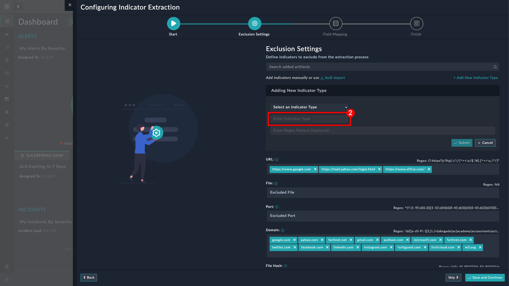
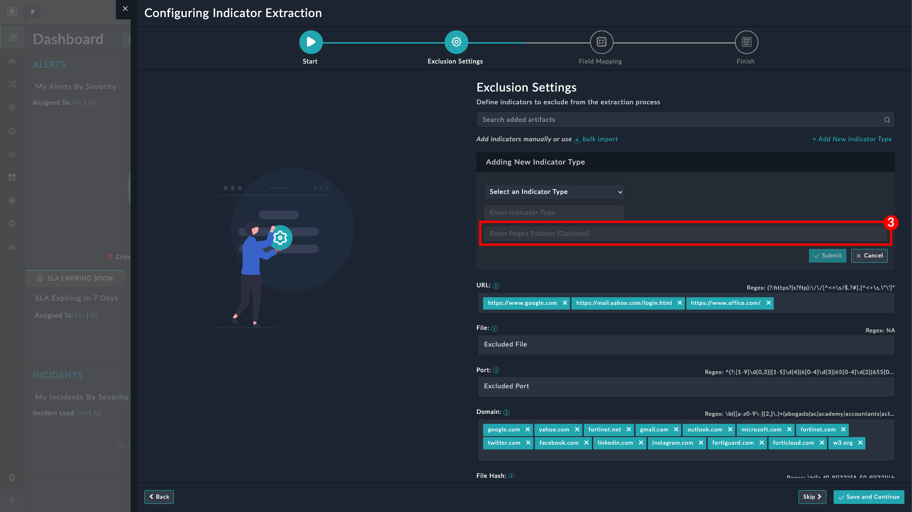
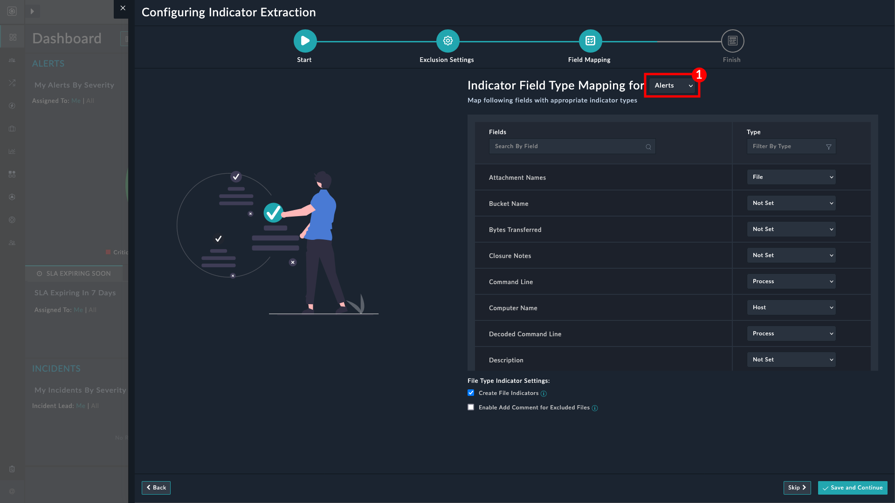
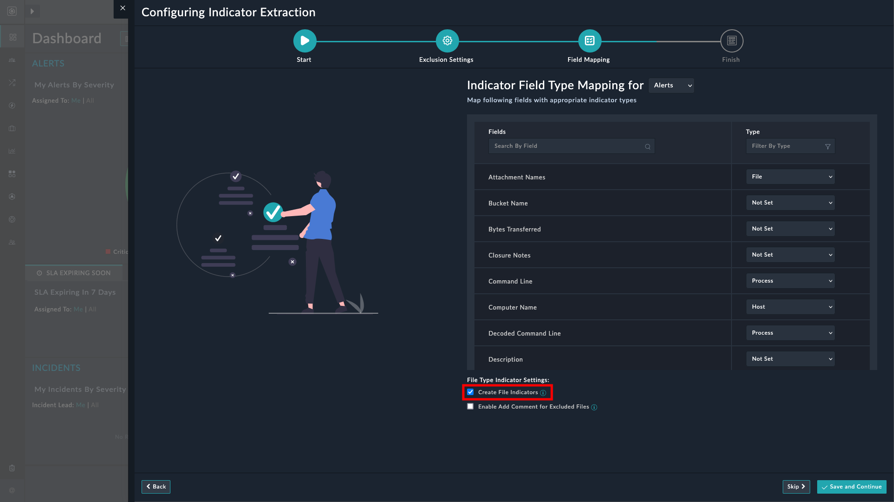
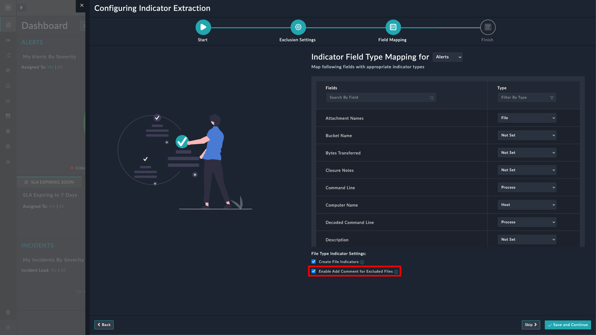

| [Home](../../README.md) |
|-------------------------|

# Indicator Extraction Configuration

You can exclude indicators from the extraction process within your FortiSOAR environment by running the **Indicator Extraction Configuration** wizard. With this wizard you can:

- Exclude indicators from extraction
- Bulk upload indicators for exclusion
- Add custom indicator types
- Map alert and incident fields with various indicator types

## Launching the Configuration Wizard

1. Launch **Setup Guide** .

    
  
2. Click to expand the **Streamline**  **Configure Indicator Extraction** section.

3. Click **Manage Indicator Exclusion List** button to launch the **Configuring Indicator Extraction** wizard.

## Indicator Extraction Configuration Wizard

The Indicator Extraction Configuration Wizard has 4 pages:

- **Start**: A welcome page that gives an overview of the **Indicator Extraction Configuration** wizard.

- **Exclusion Settings**: Use the available options to add indicators, manually or in bulk, to exclude them from extraction.

- **Field Mapping**: Map alert and incident fields to appropriate indicator types.

- **Summary**: The summary page lists the changes that you have made to the indicator extraction and mapping process.

### Adding an Indicator

Adding an indicator enhances detection, correlation, and response by providing actionable intelligence for potential threats.

To add an indicator, enter the appropriate value in the relevant field and press `Enter` or `Tab` on the keyboard. For example, you can enter `192.168.0.0/16` in the *CIDR Range* field and press `Enter` or `Tab` on the keyboard to exclude the CIDR range `192.168.0.0/16` from extraction.

Click  **Save & Continue** to save the changes and move to the next page.

You can verify that the indicators have been added, on the *Summary* page of the wizard.

> [!Note]
> Click  against an indicator to remove it from the exclusion list.

### Adding Indicators in Bulk

Bulk addition of indicators simplifies ingestion from SIEMs, EDRs, and other sources, saving time, reducing errors, and ensuring comprehensive, consistent threat coverage compared to manual addition.

1. Select  *bulk import* to open the file upload interface.

2. Select the file containing indicators to upload. You can upload files in any of these formats - `.csv`, `.txt`, `.pdf`, `.xls`, `.xlsx`, `.doc`, `.docx`.

    - To add defanged indicators to exclusion list, select the **Extract Defanged Indicators** checkbox.

3. Select the button  **Import** to start the import process. The time taken to import depends on the size of the uploaded file.

4. Click  **Save & Continue** to save the changes and move to the next page.

> [!Note]
> Maximum allowed file size is 25 MB. Invalid indicators are ignored.

### Searching Existing Indicators

The search feature for indicators allows quick retrieval of previously added indicators, streamlining investigations, enabling correlation, and ensuring efficient reuse of existing threat intelligence.

The following image highlights the search field using which you can search for added indicators:



### Adding a New Indicator Type

Custom indicator types allow organizations to align their threat detection and response processes with unique operational and security challenges.

Some examples of custom indicator types may include IoT device identifiers, geolocation tags, or even suspicious transaction IDs.

1. Select ** Add a New Indicator Type**.

2. Select ** Add Custom Indicator Type** from the **Select an Indicator Type** drop-down.

    

3. Specify an indicator type in the next field. For example: *IoT Device*

    

4. Enter a regex pattern to capture the custom indicator type for exclusion.

    

    Following is a simple regex pattern for capturing IoT device identifiers (For example, MAC addresses or serial numbers):  

    **Pattern** (for MAC address-style identifiers):
    `([0-9A-Fa-f]{2}[:-]){5}([0-9A-Fa-f]{2})`

    Matches five groups of two hexadecimal characters separated by colons `:` or hyphens `-`. and a final group of two hexadecimal characters.  

    **Alternative Pattern** (for generic alphanumeric serial numbers):  
    `[A-Za-z0-9\-]{8,20}`

    Matches alphanumeric characters and hyphens, with a length between 8 and 20 characters, commonly used for serial numbers.  

    Choose the pattern based on the format of the IoT device identifier you want to capture.

5. Click ** Submit**. The new indicator type is added and displayed at the end of the page.

6. Click  **Save & Continue** to save the changes and move to the next page.

> [!Tip]
> You can also use this process to edit the new indicator type that you have added.

### Adding Indicator Exclusion Regex

You can specify your own regex pattern to accommodate unique data patterns, exclude false positives, or align with organizational standards for extracting or excluding specific indicators. Regex enables precise, flexible, and automated extraction or exclusion of indicators based on defined patterns, ensuring accurate data parsing while minimizing false positives and irrelevant matches.

1. Select ** Add a New Indicator Type**.

    

2. Select an indicator type from the **Select an Indicator Type** drop-down. You can choose from the following options:
    - Host
    - Email Address
    - Registry
    - Process
    - User

        Or select ** Add a New Indicator Type** to specify regex for a custom indicator type.

3. Enter a regex pattern to capture the custom indicator type for exclusion. 

    

    For example following is a simple regex for capturing file type indicators:

    ```regex
    [a-zA-Z0-9_\-]+\.[a-zA-Z0-9]{2,6}
    ```

    Matches the file name, allowing alphanumeric characters, underscores, hyphens, literal periods before the file extension, and common file extensions with 2–6 characters, such as `.exe`, `.pdf`, `.jpeg`.

5. Click ** Submit**. The new indicator type is added at the end of the page.

6. Click  **Save & Continue** to save the changes and move to the next page.

### Field Type Mapping for Alerts or Incidents

Mapping alert or incident field types with indicator types ensures accurate data extraction, enables automated enrichment, correlates related entities, and supports actionable threat intelligence workflows within security operations.

The user interface is very intuitive and makes the mapping task easier.

1. Select **Alerts** or **Incidents** from the drop-down (highlighted in the following image)

    

2. Scroll down and review the available fields of the selected module (Alert or Incident).

3. Select an appropriate indicator type for each applicable field.

4. Click  **Save & Continue** to save the changes and move to the next page.

### Creating File Indicators from Email Attachments

Creating separate file indicators for email attachments allows precise threat analysis, correlation, enrichment, and automated response to potentially malicious files in SOAR workflows.

- Select the checkbox **Create File Indicators** on the *Field Mapping* page of the *Indicator Extraction Configuration* wizard.

    

- Click  **Save & Continue** to save the changes and move to the next page.

The wizard now creates indicators of type *File*, from email attachments in alerts of type *Suspicious Email* and *Phishing*.

### Adding Comment for Excluded Files

Adding comments to excluded files documents exclusion reasons, aids future analysis, prevents redundant reviews, and ensures clarity in SOAR workflows for consistent threat handling.

- Select the checkbox **Enable Add Comment for Excluded Files** on the *Field Mapping* page of the *Indicator Extraction Configuration* wizard.

    

- Click  **Save & Continue** to save the changes and move to the next page.

For each file excluded from extraction, a comment is added to the associated alert. For example, a file named `headers.txt` carries the comment

>`headers.txt` has been excluded from file indicator creation.

# Next Steps

| [Installation](../setup.md#installation) | [Configuration](../setup.md#configuration) | [Usage](../usage.md) | [Contents](../contents.md) |
|------------------------------------------|--------------------------------------------|----------------------|----------------------------|