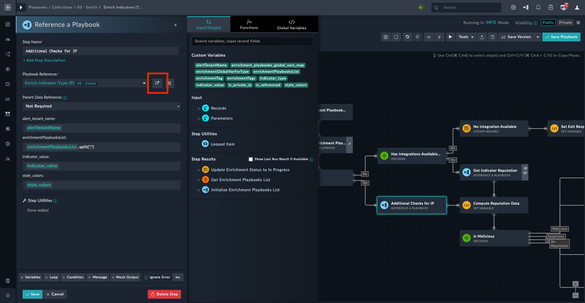

# *Pluggable* Enrichment Support for Shared Tenancy

In shared tenancy each shared tenant has a different connector configuration. However, only the default connector configuration is used for the shared tenant record. This section helps configure *pluggable* enrichment support for shared tenancy. To know more about shared tenancy refer to the [Multi-Tenancy Support Guide](https://docs.fortinet.com/document/fortisoar/7.4.0/multi-tenancy-support-guide/744444/shared-tenancy-support) in FortiSOAR&trade; product documentation.

|**NOTE**| When creating a connector configuration for a shared tenant, keep the configuration name as that of the tenant (FortiSOAR&trade; `v7.2.2` onwards). For example, if your tenant is `Tenant_1` the connector configuration name should be `Tenant_1`. |
|-|-|

The following steps outline how to set up and configure *pluggable* enrichment for shared tenants.

1. Edit the configured connector's enrichment playbooks. The enrichment playbooks are of the format `indicator-type > threat-intelligence-platform > Enrichment`.

2. Edit to add a new parameter - `alert_tenant_name`.

3. Edit the enrichment playbook `Get <indicator-type> Reputation` step.

4. Assign the configuration name as `{{vars.input.params['alert_tenant_name']}}`.

5. Edit the [*03 – Enrich > Enrich Indicators (Type All)*](#editing-indicator-enrichment-playbook) playbook.

Following sections explain these steps with an example where threat intelligence platform is **VirusTotal** and indicator type is **URL**

## EXAMPLE: Editing VirusTotal's *Pluggable* URL Enrichment Playbook

1. Click to edit the **URL > VirusTotal > Enrichment** playbook.

2. Click **Tools** > **Edit Parameters**.

3. Click **+ Add Parameter** to add a new parameter.

4. Add a new parameter named `alert_tenant_name` and click **Submit**.

5. Edit the `Get URL Reputation` step.

6. Assign the configuration name as `{{vars.input.params['alert_tenant_name']}}` and click **Save**.

Similar steps are required for each configured threat intelligence platform's connector for each indicator type (URL, IP address, Domain, etc.).

## Editing Indicator Enrichment Playbook

Following steps help edit the *03 – Enrich > Enrich Indicators (Type All)* playbook.

1. Edit the the *Configuration* step of the playbook.

2. Create a variable `alertTenantName` to get the alert’s tenant name. Use the following Jinja expression:

    ```jinja
    {{ (((vars.input.params['indicator_IRI'] + "?$relationships=true&$export=true") | fromIRI).alerts[0] | fromIRI).tenant.name}}{{ (((vars.input.records[0]['@id'] + "?$relationships=true&$export=true") | fromIRI).alerts[0] | fromIRI).tenant.name}}
    ```

3. Edit the *Get Indicator Reputation* step.

    1. Add a new **Argument** `alert_tenant_name` and assign the value `{{vars.alertTenantName}}`.

4. Edit the *Additional Check for IP* step.

    1. Open and edit the underlying playbook.

        

    2. Click **Tools** > **Edit Parameters** and add a new parameter `alert_tenant_name`.
    3. Edit the step *Get Indicator Reputation*.
    4. Click **+ Add More** to add a new argument `alert_tenant_name`.
    5. Set the value of this argument as `{{vars.input.params['alert_tenant_name']}}`.
    6. Return to the **Enrich Indicators (Type All)** playbook. The step *Additional checks for IP* now lists the added variable - `alert_tenant_name`.
    7. Set the value of this variable as `{{vars.alertTenantName}}`.
