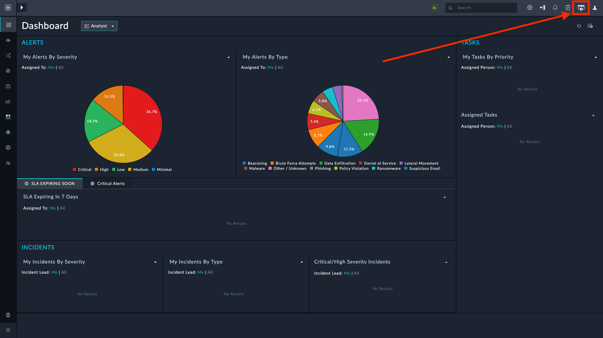
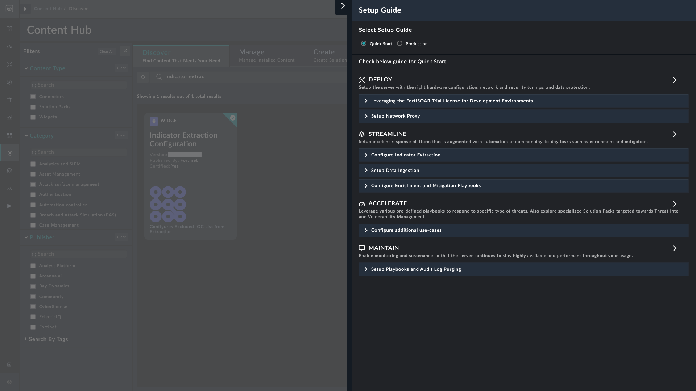
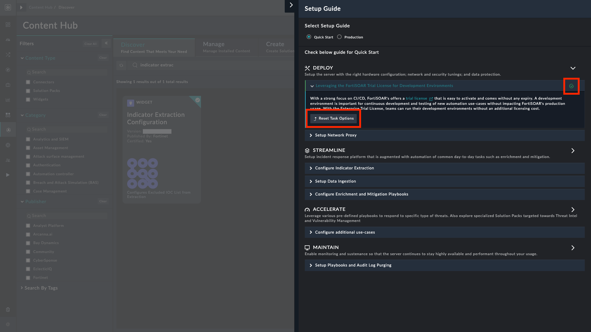

| [Home](../../README.md) |
|-------------------------|

# Setup Guide

The **Setup Guide** helps first-time or recurrent FortiSOAR administrators to optimally set up FortiSOAR based on best practices. It helps administrators perform various important configurations and install solution packs vital for the smooth working of their FortiSOAR environment.

## Prerequisites

The **Setup Guide** wizard is supported on FortiSOAR v7.6.0 and later.

To view the FortiSOAR setup guide, you must be assigned a role with the following minimum permissions:

1. `Read` and `Update` permissions on the **Application** module
2. `Read` and `Update` permissions on the **Security** module
3. `Read` and `Usage` permissions on the **Widgets** module
4. `Read` permissions on the **Solution Pack** module

>[!NOTE]
>Each underlying task may require additional permission.

## Getting Started

The Setup Guide icon is available immediately when an administrator logs into FortiSOAR.

To view the details of the FortiSOAR Setup Guide, click the FortiSOAR **Setup Guide** icon .

The FortiSOAR Setup Guide has two flavors.

- **Quick Start**: Select Quick Start to quickly set up FortiSOAR with the minimum required settings for optimal functioning. *Quick Start* contains important system configurations that FortiSOAR highly recommends you set up.

- **Production**: Select Production to set up FortiSOAR with all the required settings for optimal functioning in a production environment. *Production* contains tasks that are dependent on the user and environment preferences.

Here, we list the tasks under **Production** as it includes the tasks in **Quick Start**, too. Each task includes links to FortiSOAR&trade;'s documentation.

> [!Note]
> By default, FortiSOAR&trade; Setup Guide opens in the **Quick Start** mode that contains limited items to set up. To view the complete list of tasks, select **Production**.

### Production Mode

The **Production** option has 4 major sections:

- **Deploy**: For tasks related to setting up the server with appropriate hardware configurations, network and security tunings, data protection, etc. The 'Deploy' section also provides information about the 'FortiSOAR Trial License,' which is easy to activate and can be used in development environments without incurring additional licensing costs. For more information about the 'Trial License', see the Licensing FortiSOAR chapter in the "Deployment Guide."

- **Streamline**: For tasks related to setting up the incident response platform, which is augmented with automation of common tasks such as enrichment and mitigation.

- **Accelerate**: For tasks related to accelerating your response time by leveraging various pre-defined playbooks to respond to specific types of threats, and installing solution packs targeted towards management of specific SOAR scenarios, such as Threat Intel management, Vulnerability Management, etc.

- **Maintain**: For tasks related to enabling monitoring and sustenance so that the server performs optimally and remains highly available throughout your usage.

For each task you have three options:

- **Mark as Done**: Click this button to mark the task as done, once you complete it.

    

    - Click **Mark as Done** to display that task with a green circular check . A **Reset Task Options** button appears in its place.

    - Click **Reset Task Options** button to bring back the options, in case you clicked **Marked as Done** in error.

- **I will complete later**: Select this button to skip that task and complete it at a later time.

    - Click **I will complete later** to collapse that task's row

    - The task action buttons remain active and appear when the row is expanded

- **Not Applicable**: Select this button if a task does not apply to your FortiSOAR environment.

    

    - Click **Not Applicable** to display that task with a struck-out, circular check . A **Reset Task Options** button appears in its place.

    - Click **Reset Task Options** button to bring back the options, in case you clicked **Not Applicable** in error.

>[!TIP]
> For more information, refer to the [**Getting Started guide**](https://docs.fortinet.com/document/fortisoar/7.6.1/getting-started/231699/overview) in the FortiSOAR product documentation.

# Next Steps

| [Installation](../setup.md#installation) | [Configuration](../setup.md#configuration) | [Usage](../usage.md) | [Contents](../contents.md) |
|------------------------------------------|--------------------------------------------|----------------------|----------------------------|