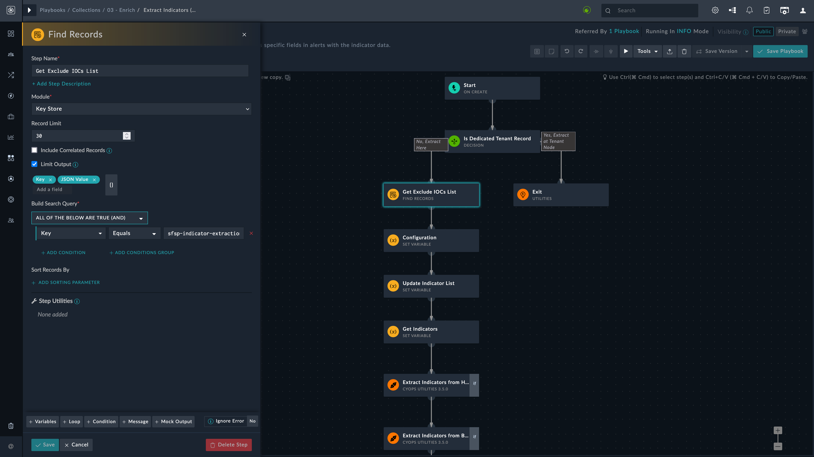
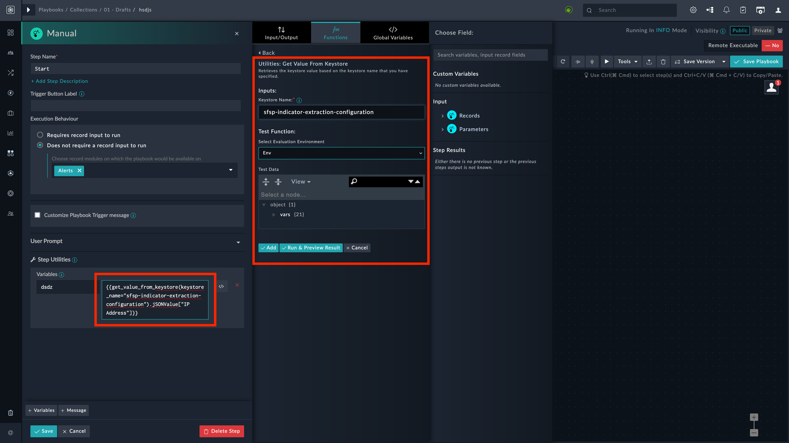

| [Home](../README.md) |
|----------------------|

# Upgrading SOAR Framework v2.x.x to latest version

> [!Note]
> On a fresh install of FortiSOAR&trade;, `Tenant` is not a uniqueness constraint for any of the modules. However, when SOAR Framework Solution Pack is upgraded, `Tenant` is added as a uniqueness constraint in **_Alerts_**, **_Incidents_**, and **_Indicators_**.

## Moving from Global Variables to Key Store Record

SOAR Framework `v3.1.0` and later uses the new keystore records instead of old keystore records and legacy global variables for indicator extraction, exclusion, and indicator type mapping.

There may be cases where user-modified playbooks are still reliant on the old keystore records or legacy global variables. This section helps users to edit their user-modified playbooks so as to use the new keystore record.

> [!Important]
> Configuration changes made through the [*Indicator Extraction Configuration*](../docs/iec/indicator-extraction-wizard.md) wizard updates the key store record and not the Global Variables.

### Editing Extraction Playbooks - An Example

Let us consider the playbook **Extract Indicators (Alerts)** as an example. We will edit this playbook to refer to the new keystore record.

1. Navigate to **Automation**   **Playbooks** .

2. Open the playbook **Extract Indicators (Alerts)**, under the collection *03 - Enrich*.

> [!Note]
> Your playbooks and the corresponding steps to be edited may be different.

3. Edit the step that handles indicator extraction or exclusion. In this example, that step is **Get Exclude IOCs List**.

    The *Build Search Query* for this step is shown in the following image:

    

    **Key** *Equals*`sfsp-indicator-extraction-configuration`

4. Similar changes may be required in other playbooks, as applicable.

## Retrieving Exclusion List

Earlier, the following expression helped retrieve excluded list of **IP addresses** using global variables:

```jinja
    {{globalVars.ExcludeList_IPs}}
```

Similar expressions retrieved exclude list for other indicator types.

Now, the following expression helps retrieve excluded list of **IP addresses** using the new keystore record:

```jinja
    {{keystore(key_name="sfsp-indicator-extraction-configuration").jSONValue["IP Address"]}}
```



# Next Steps

| [Installation](./setup.md#installation) | [Configuration](./setup.md#configuration) | [Usage](./usage.md) | [Contents](./contents.md) |
|-----------------------------------------|-------------------------------------------|---------------------|---------------------------|